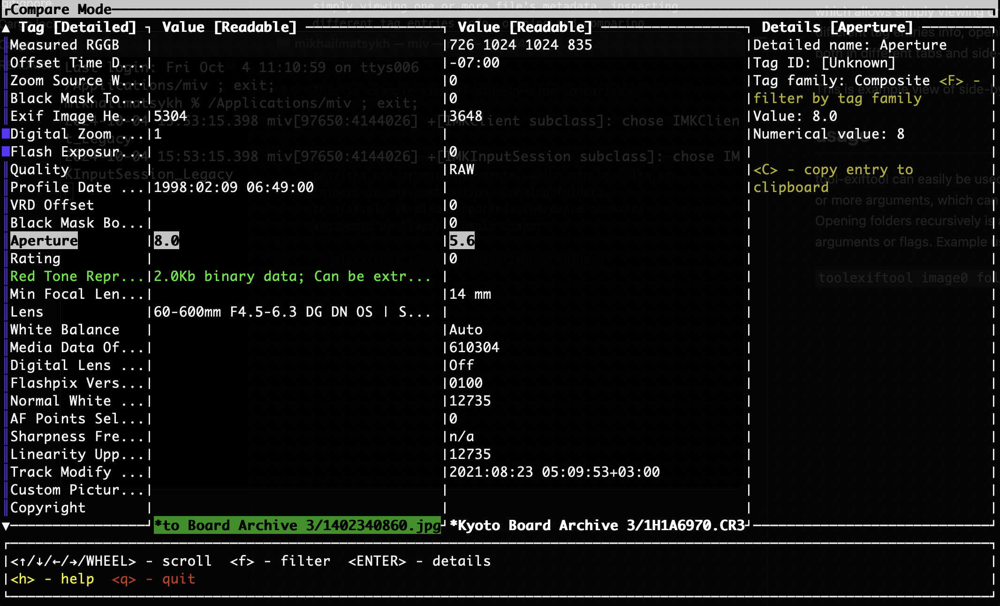

# tool-exiftool

tool-exiftool is a crosplatform wrapper over [ExifTool by Phil Harvey](https://exiftool.org/), which allows simply viewing one or more file's metadata, inspecting different tag entries info, opening and comparing multiple files/folder both in different tabs and side-by-side.  

This is example view of side-by-side comparison:

## usage

tool-exiftool can easily be used from command line and requires one or more arguments, which can be files or folders in any combination. Opening folders recursively is also supported. There are no extra arguments or flags. Example usage:  

`toolexiftool image0 folder1 image2 folder3`

## features

- open single file or multiple files and/or folders
- viewing tag numerical value, id, index, family
- opening tag family info on [exiftool tags page](https://exiftool.org/TagNames/)
- extracting binary data from tags
- __filtering tags by name or value__
- filtering tags by family
- __opening files in side-by-side compare mode__
- showing only entries that differ while in side-by-side compare mode
- copying tag data to system clipboard

## maybe in future

- writing/deleting/modifying tags
- copying tags from other opened files while in multiple files mode
- more mouse support